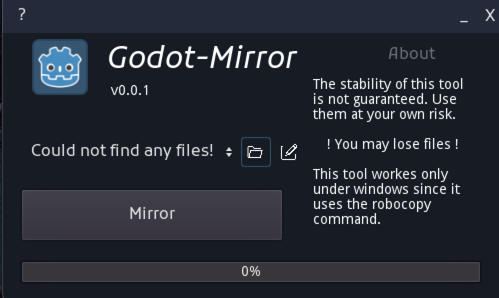

# How to use

1. Create a config file
   1. It has to be a JOSN-File like _config.json_
   2. The JSON inside needs to have 2 attributes:
      1. Input - Array of Strings: Input paths
      2. Output - String: Output path
2. Open the directory containing the file with the folder icon.
   1. You can edit the file with the pen icon
3. Select the correct config file in the drop down button nex to the folder icon
4. Press the Mirror button

**Example config file**
{
  "input": ["path_to_dir_1", "path_to_dir_2"],
  "output": "path_to_backup_dir"
}

# The UI

